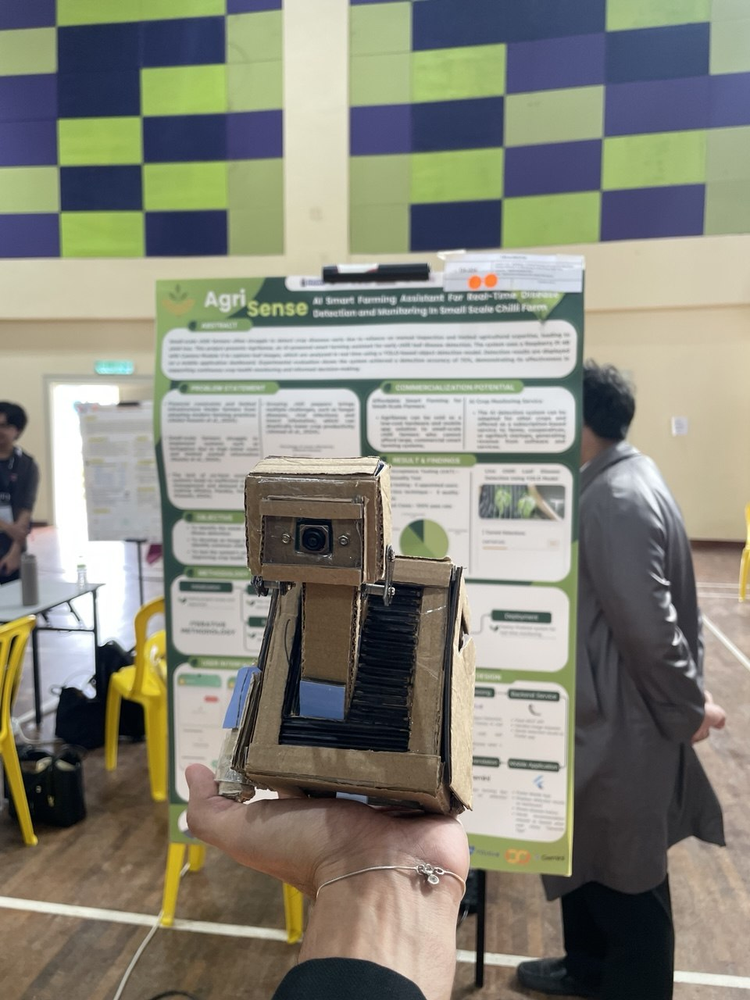

**AgriSense**

- **Purpose:**: AgriSense is a Flutter-based crop health monitoring app that performs real-time disease detection on live camera streams and provides concise AI-generated treatment recommendations for farmers.

**Features**
- **Real-time Detection:**: Polls a detection backend to identify plant diseases from a live stream.
- **AI Recommendations:**: Uses a generative AI (Gemini) to produce short, actionable treatment steps.
- **Notifications:**: Push alerts when issues are detected.
- **History & Analytics:**: Stores detections for historical tracking and statistics.
- **Sync & Offline Cache:**: Local caching and sync to Supabase for persistence.

**Architecture / Key Components**
- **Frontend:**: Flutter UI in `lib/` (main app shell, dashboard, statistics, history, settings).
- **Detection Client:**: [lib/detection_service.dart](lib/detection_service.dart) — fetches and normalizes detection payloads.
- **AI Recommendation:**: [lib/gemini_service.dart](lib/gemini_service.dart) — builds prompts, rate-limits, caches, and calls the Gemini generative API.
- **App Entry:**: [lib/main.dart](lib/main.dart) — app initialization, Supabase, services, and navigation.
- **Dependencies:**: See [pubspec.yaml](pubspec.yaml) for packages (Supabase, provider, flutter_local_notifications, http, etc.).

**Required environment variables**
- **GEMINI_API_KEY:**: API key for the generative AI used by `GeminiService`.
- **DETECTION_SERVER_URL:**: Endpoint for detection backend used by `DetectionService` (default fallback configured in code).
- **SUPABASE_URL / SUPABASE_ANON_KEY:**: Supabase credentials used in `main.dart` for persistence and sync.

**PS: Just follow the template in .env.example**

```bash
flutter pub get
flutter run -d <device>
```

**Screenshots**

Side-by-side preview 


<table>
	<tr>
		<td align="center">
			
			<div><strong>Live Stream</strong></div>
		</td>
		<td align="center">
			
			<div><strong>Statistics</strong></div>
		</td>
		<td align="center">
			
			<div><strong>History</strong></div>
		</td>
	</tr>
</table>

---

**Edge Device: Raspberry Pi 4B (Camera Module 3)**

| Raspberry Pi 4B | Description |
|---:|---|
|  | **Purpose:** The Raspberry Pi 4B paired with the Camera Module 3 captures the live video feed of the crop canopy. The Pi runs a small Flask server (default port 5000 in this project) that:
	- streams live video locally to the mobile app/dashboard, and
	- exposes detection results for the Flutter app to poll (`DETECTION_SERVER_URL`, default `http://your local url`).

This edge device handles capture and lightweight preprocessing so the mobile app can receive a live view and the latest detection results over the local network. Keep the Pi and mobile device on the same LAN or use a secure tunnel for remote access.

