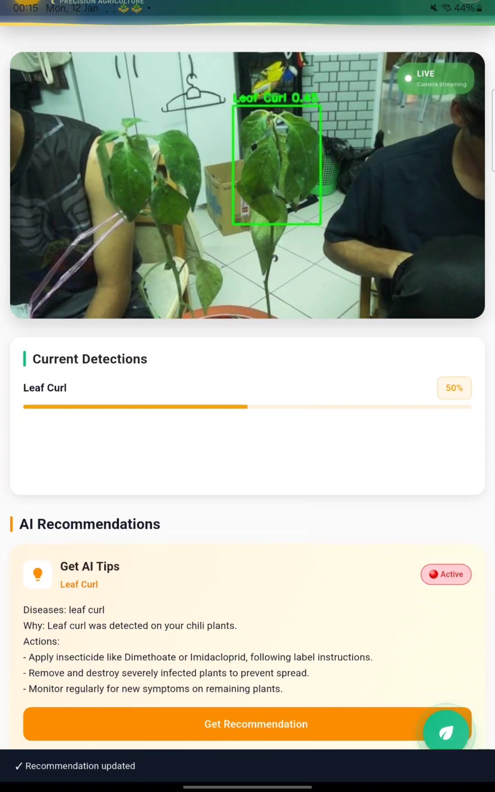
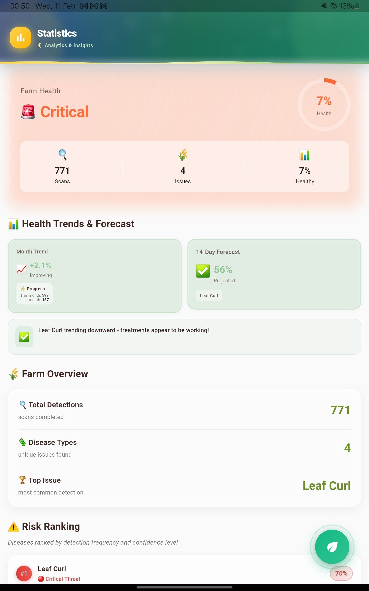
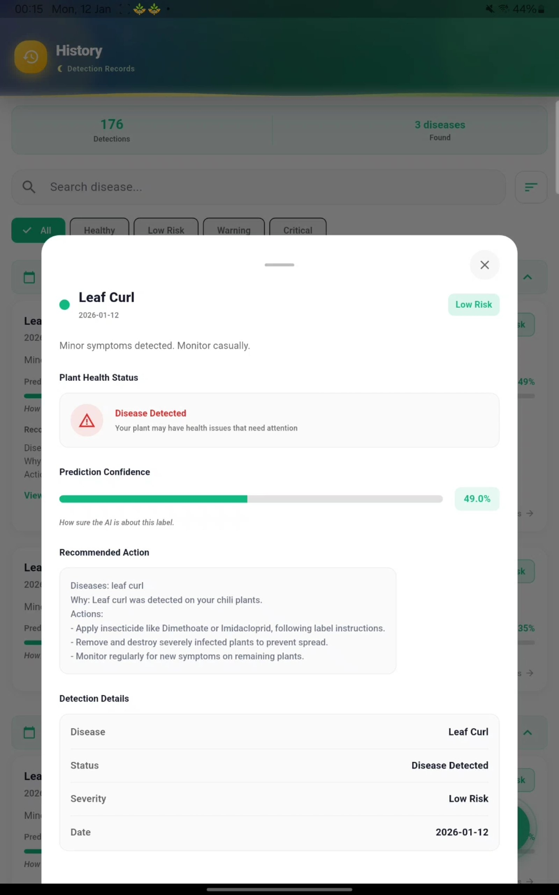

**AgriSense**

- **Purpose:**: AgriSense is a Flutter-based crop health monitoring app that performs real-time disease detection on live camera streams and provides concise AI-generated treatment recommendations for farmers.

**Features**
- **Real-time Detection:**: Polls a detection backend to identify plant diseases from a live stream.
- **AI Recommendations:**: Uses a generative AI (Gemini) to produce short, actionable treatment steps.
- **Notifications:**: Push alerts when issues are detected.
- **History & Analytics:**: Stores detections for historical tracking and statistics.
- **Sync & Offline Cache:**: Local caching and sync to Supabase for persistence.

**Architecture / Key Components**
- **Frontend:**: Flutter UI in `lib/` (main app shell, dashboard, statistics, history, settings).
- **Detection Client:**: [lib/detection_service.dart](lib/detection_service.dart) — fetches and normalizes detection payloads.
- **AI Recommendation:**: [lib/gemini_service.dart](lib/gemini_service.dart) — builds prompts, rate-limits, caches, and calls the Gemini generative API.
- **App Entry:**: [lib/main.dart](lib/main.dart) — app initialization, Supabase, services, and navigation.
- **Dependencies:**: See [pubspec.yaml](pubspec.yaml) for packages (Supabase, provider, flutter_local_notifications, http, etc.).

**Required environment variables**
- **GEMINI_API_KEY:**: API key for the generative AI used by `GeminiService`.
- **DETECTION_SERVER_URL:**: Endpoint for detection backend used by `DetectionService` (default fallback configured in code).
- **SUPABASE_URL / SUPABASE_ANON_KEY:**: Supabase credentials used in `main.dart` for persistence and sync.

**PS: Just follow the template in .env.example**

```bash
flutter pub get
flutter run -d <device>
```

**Screenshots**

Side-by-side preview 

  
